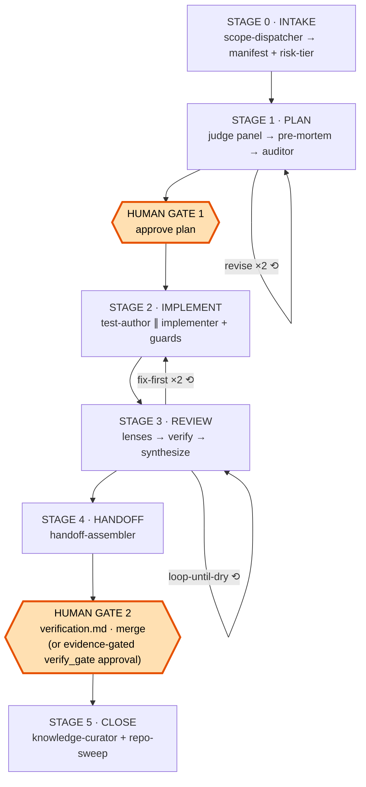
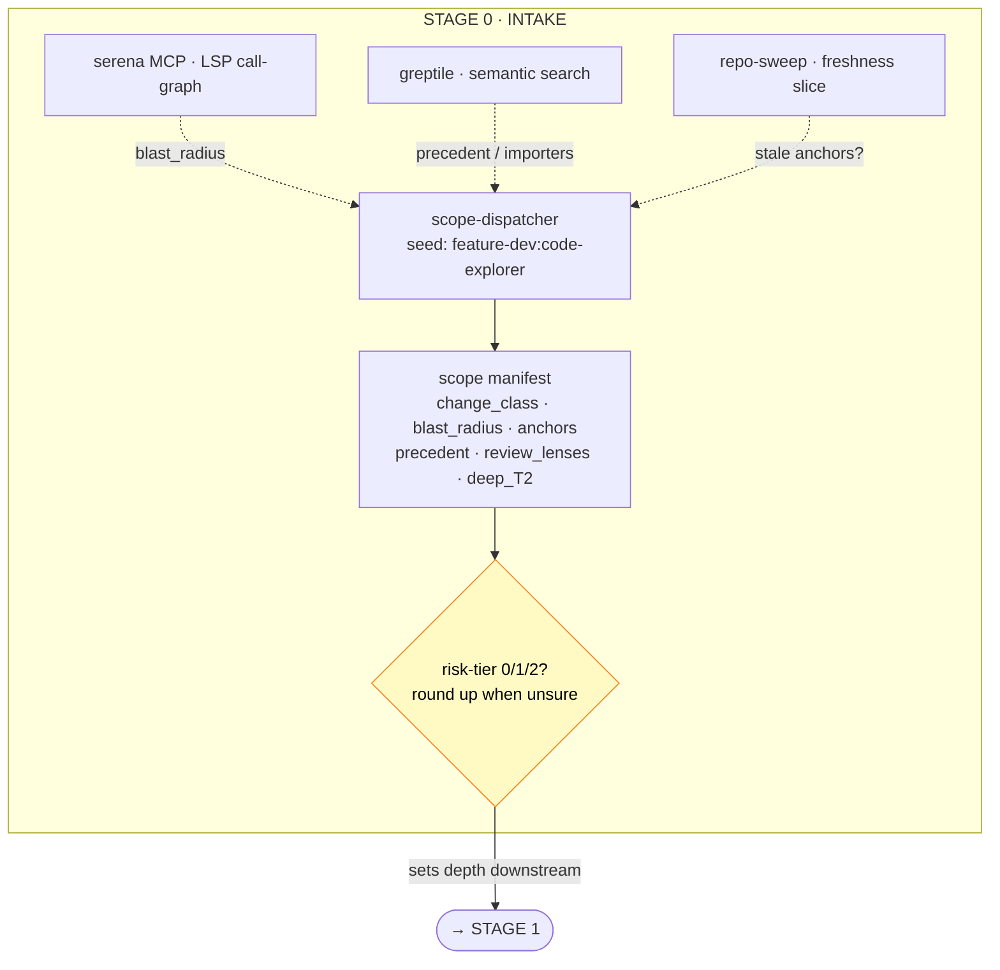
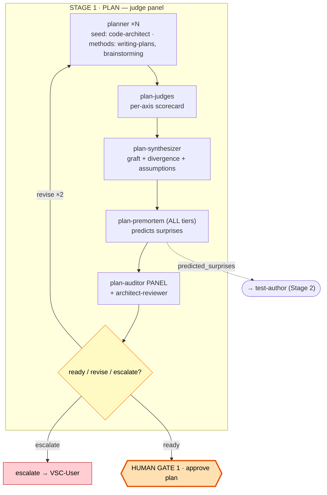
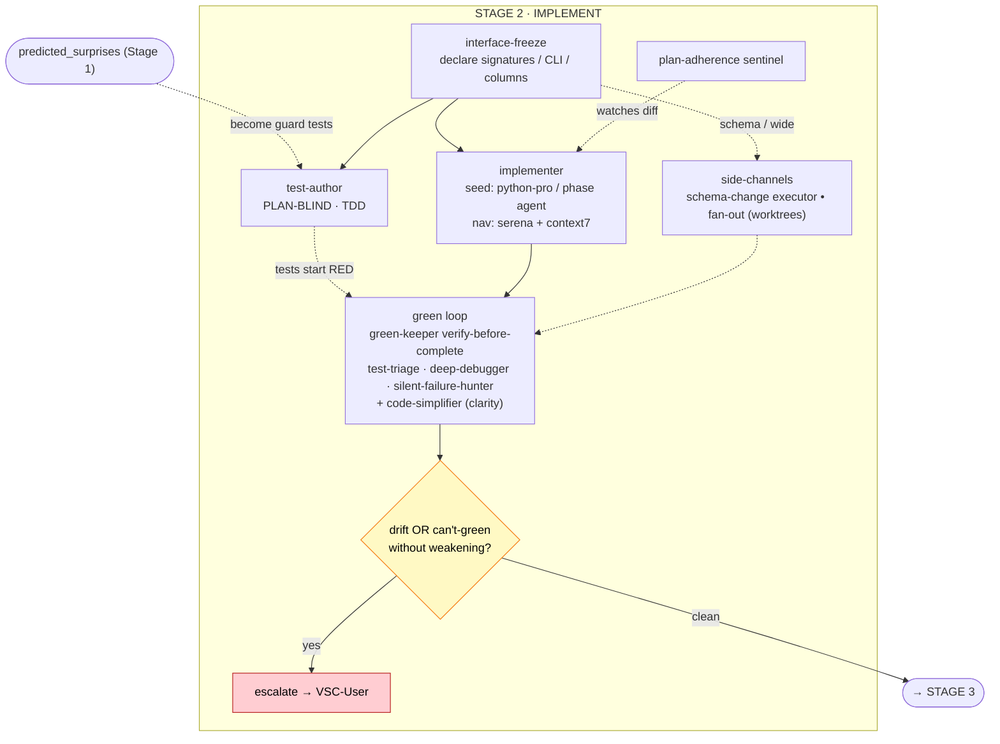
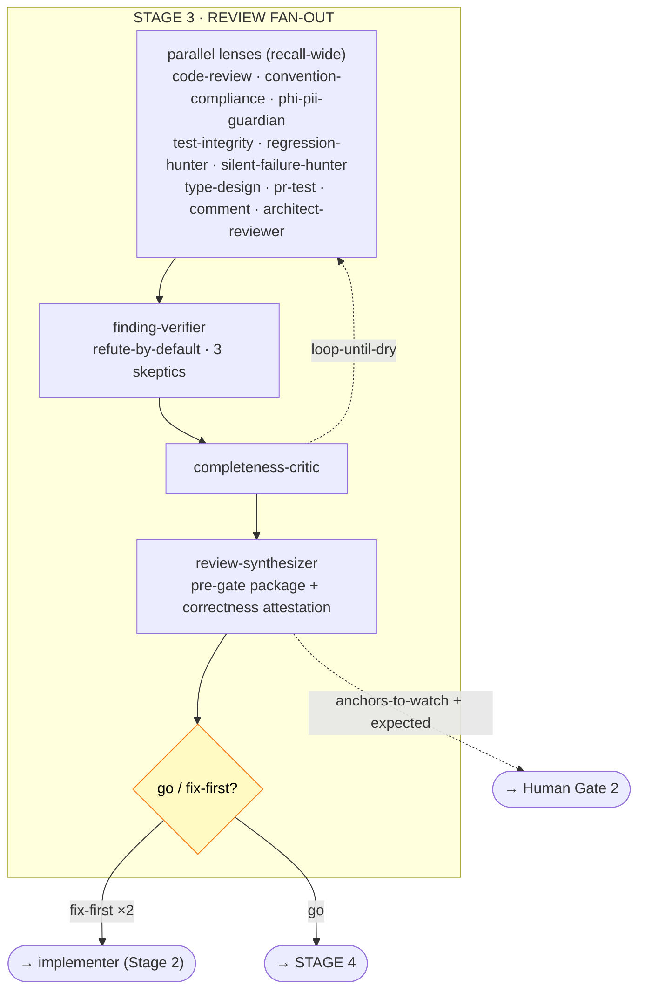
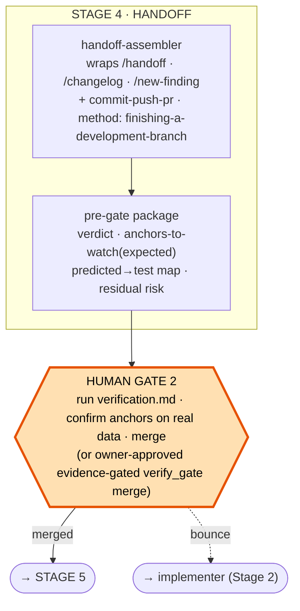
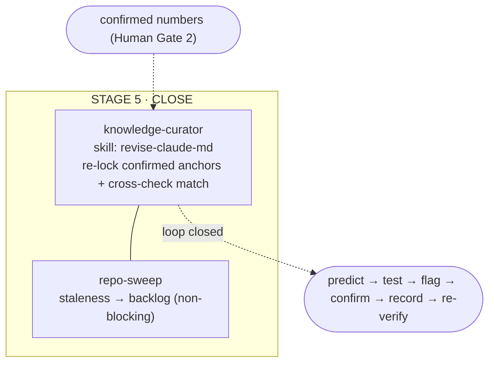
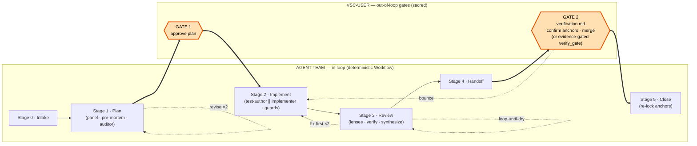

# Agent-team workflow — per-scope team design (Stages 0–5, correctness-maximized)

## Status

**Design-only brainstorm at capture (2026-06-18) — since superseded: the team was
built ahead of the pre-Phase-6 gate and merged in PR #79 (2026-06-21). See the "Build
status" callout below; the design text that follows is preserved as the rationale.**
The document was captured (see `ROADMAP.md` → "Pre-Phase-6 sequence") as the
implementation brief that PR #79 then executed, building the members as
`.claude/agents/*.md` subagents plus the opt-in orchestration workflows. Captured
2026-06-18 during a workflow-design session between VSC-User and
ClaudeCodeVerification / ClaudeCodePlanning (no code was written that session).

> **Build status (built 2026-06-20; merged in PR #79, 2026-06-21).** VSC-User directed
> the build ahead of the pre-Phase-6 gate. **All five stages (0–5) are now built** under `.claude/`: the 23
> members in `.claude/agents/*.md`, three segmented orchestrators
> (`plan-phase.js`, `implement-review.js`, `close.js` — split by the two human gates),
> the four authoring skills in `.claude/commands/`, and the four guardrail hooks. The
> one runtime caveat noted at build — the dynamic-workflows subagent-invocation primitive
> was treated as undocumented, each orchestrator isolating it behind a single `runAgent()`
> helper (`node --check`-clean, not end-to-end executed) — is **superseded by the Amendment
> below**: Sub Project C2-D confirmed the engine dialect empirically and ported all three
> orchestrators to it. See `.claude/agents/README.md`.

> **Amendment (Sub Project C2-D, 2026-06-25 — `finding-034` / `DEC-0099`).** The build-status
> caveat above is now **superseded**. The dynamic-workflows engine dialect is
> **empirically confirmed** (and documented in this Amendment; the C2D-Phase1 load-model probe —
> see the probe-evidence appendix at the end of this finding): the engine loads a workflow by
> reading the pure-literal `export const meta` and wrapping the rest of the body in an async
> function with the hooks `agent · parallel · pipeline · log · phase · budget · workflow ·
> args` injected as parameters; subagents are invoked via `agent(prompt, {agentType, schema})`,
> where a `schema` returns a validated object (replacing the old hand-rolled output coercion +
> key-assertion) and a schema-less call returns prose. The three orchestrators
> (`plan-phase.js`, `implement-review.js`, `close.js`) are **ported to that dialect** —
> self-contained (no `import`), `return pkg` terminator, validated by an AsyncFunction
> construct-check — closing six fidelity gaps: the Tier-0 minimal-diff planner; the Tier-2
> architect-reviewer folded into one severity→verdict ladder; the Stage-4 `handoff-assembler`
> wired on the `go` path (returning prose, stored as a string); the four trigger-gated Stage-2
> members on real triggers, with `fan-out-implementer` *replacing* the single implementer;
> severity-scaled refute-by-default verification (blocker → 2–3 distinct-angle skeptics,
> strict-majority survival); and budget-guarded escalation. This **reverses the orchestration
> default from model-driven to engine-primary** (the prior "runnable-today" framing): the
> deterministic JS workflows are now the preferred path, while the model-driven `/scope-run`
> conductor is **retained** as the by-name segment launcher and the headless/cron fallback.
> Both human gates and the team/membership design are **unchanged** — which is why this is
> recorded **pure-append** (`DEC-0099`, leaving the design `DEC-0020` active and unflipped, per
> the `DEC-0086`/`DEC-0087` precedent), not a supersession of this finding. The Stage-4 row in
> `.claude/agents/README.md` is correspondingly flipped to *wired*.

> **Amendment (Sub Project C2-D Phase 2, 2026-06-28 — `finding-034` / `DEC-0122`).** The
> **reversal-gate** that the "C2D-Phase1 residual risk" section below flagged as Phase 2 has
> **landed** (PR 1 + PR 2). PR 1 fixed the latent StructuredOutput 400 — all 21 `SCHEMAS` entries
> across the three workflows are now valid JSON Schema (`type:'object'` + `properties` +
> `additionalProperties: true`; permissive `{}` property values so the engine never over-constrains
> an agent's real return), restoring the team workflows on the real engine (smoke run
> `wf_812305d6-ef9`). PR 2 added the engine-primary CLI `genome workflows` and its DB-free,
> fail-closed `genome workflows check` gate: **seam-drift** (GT-1's duplicated `agent()`/retry seam
> stays logically identical, located via `// agent-seam:start`/`:end` sentinels and normalized on
> the two legit per-file dimensions, fail-closed if unlocatable) + **schema-validity** (every
> `SCHEMAS` entry declares `type:'object'`, locking the PR-1 fix). The gate mirrors
> `genome docs check` (own `model`/`seam`/`schemas`/`validator`/`cli`, clean-subprocess DB-free
> guard), is wired into the dev-loop + a `workflows-gate` CI workflow, and the one
> intentionally-skipped `drift.test.mjs` test (EC5) is **un-skipped** as the gate's node mirror (the
> harness is now 0-skips). Recorded pure-append (`DEC-0122`, leaving `DEC-0099`/`DEC-0020` active).
> The two remaining residuals in the section below — **D7** (live-engine validation of the four
> trigger-gated Stage-2 writers) and **arch-1** (exhaustive harness `parallel`/`pipeline` fan-out
> coverage) — land in PR 3, which also flips the ROADMAP slot to close Sub Project C2+D.

Decisions locked this session:

- The planner uses **Option B** — a judge-panel of *diverse* candidate plans, not a
  single planner.
- The phase runs at **adaptive depth** — three tiers selected by the dispatcher from
  the scope's risk, so a docstring batch and a canonicalize re-lock get different
  amounts of planning intelligence.
- **The pre-mortem runs at Tier 1 and Tier 2** (not Tier 2 only).
- The low-hanging-fruit finder is **`repo-sweep`** (a read-only *detector*), paired
  with `knowledge-curator` (the *fixer*); a narrow freshness slice of it also lives
  inside the dispatcher.
- The two **human gates** (plan approval; merge verification) are **preserved** — the
  team is segmented *by* them and never substitutes for them.
- **Implementation (Stage 2, added 2026-06-19):** the spine is a single `implementer`
  wrapped in guards. Implementation parallelizes *worst* of the three phases, so agent
  fan-out is reserved for genuinely independent mechanical breadth (the opt-in
  ultra-prefixed mode's niche), not the act of writing a coherent change.
- The **`test-author` is plan-blind** — it writes the §5 tests from the approved plan's
  §5/§6 plus a frozen interface contract, **without reading the implementation's
  bodies/logic**, making the suite an independent oracle against the
  "fixtures-shaped-to-the-implementation" failure mode `verification.md` guards.
- **Review (Stage 3, added 2026-06-19):** review fans out — N independent lenses on a
  *fixed* diff, the canonical multi-agent win. It optimizes for **precision over recall
  at the human boundary**: a finding reaches VSC-User only if it **survives adversarial
  refutation** (`finding-verifier`, refute-by-default); everything else is logged.
- Stage 3 **composes existing skills as lenses** (`/code-review`, `/security-review`)
  rather than reinventing them; `phi-pii-guardian` is the domain-specialized security
  lens. The review **never replaces** VSC-User's independent `verification.md` run — it
  produces the *pre-gate package* that makes that run cheaper and more exact.
- **Handoff + Close (Stages 4–5, added 2026-06-19):** Stage 4 is assembly — it wraps
  `/handoff` + `/changelog` + `/new-finding` and enriches them with the team's pre-gate
  package (verdict, anchors-to-watch, residual risk). Stage 5 is the **only stage that
  writes durable docs**: `knowledge-curator` re-locks the anchors VSC-User confirmed at
  the gate — post-merge, human-confirmed numbers only, via a reviewable change, never a
  silent mutation — closing the anchor loop (predict → flag → confirm → record).
- **Correctness-maximized refinement (added 2026-06-20):** vetted marketplace agents
  folded in (audit-approved seeds / adjuncts / methods) and every stage bolstered for
  **correctness over speed/tokens** — pre-mortem at *all* tiers, `predicted_surprises`
  become required guard tests, **+5 review lenses**, 3-skeptic verify + loop-until-dry by
  default, verification-before-completion, a correctness attestation + post-merge anchor
  re-verification, serena-LSP blast-radius, and an explicit *over-tier-when-unsure* bias.
  Reconciling rule: **widen recall on the find side, restore precision at the
  verify→synthesize funnel** — more coverage costs tokens, never human attention. See
  "Correctness-maximized refinement" and the independently-verified "Workflow diagrams"
  sections below.

This finding covers the **full per-scope team (Stages 0–5)** — Plan (0–1),
Implementation (2), Review fan-out (3), Handoff (4), Close (5); Stages 2–5 added
2026-06-19, the correctness-maximized refinement + independently-verified Mermaid diagrams
added 2026-06-20. No stages remain to design.

## Context

The repository is built by five actors (`CLAUDE.md` → "Working with this codebase"):
ClaudeCodeVerification, ClaudeCodeTestingBugs, ClaudeCodePlanning,
ClaudeCodeDevelopment, and the human VSC-User. Today VSC-User hand-routes work
between these as separate chats. The "agent team per scope" goal is to **automate
that routing** for one unit of scope (a numbered ROADMAP slot, e.g. "PR 6"), while
keeping VSC-User's independent verification gate exactly where it is.

The Plan phase turns a ROADMAP slot into a plan VSC-User can approve on first read.
Its members map onto existing actors:

- `scope-dispatcher` → *new* (formalizes the plan-mode "read the listed inputs first"
  step into a structured manifest).
- `planner` → **ClaudeCodePlanning**.
- `plan-judges` / `plan-synthesizer` / `plan-premortem` → *new* intelligence layer.
- `plan-auditor` → **ClaudeCodeVerification** (its plan-review function).
- then the **human plan-approval gate** → **VSC-User**.

The design rule a naive "agent team" would break: the merge-verification gate
(`docs/runbooks/verification.md`: *"not optional and is not negotiable"*) exists
precisely because it runs **outside the loop that produced the change**. An agent
team is still that loop. So the team produces the *pre-gate package*; the human gates
remain independent. The Plan phase therefore ends at a human decision, not at an
auto-approval.

> **Amendment (Sub Project A, 2026-06-25 — `finding-037`).** The merge gate gained an
> owner-approved **evidence-gated** path: Claude may run the full verification protocol
> through a fail-closed, unit-tested core (`genome.verify_gate`), present the **raw**
> evidence, take a typed approval, and then squash-merge. This does **not** repeal the
> rule above — it sharpens *where* the independence has to live. The danger an
> in-loop merge introduces is a **false-GREEN**; the response is to move every decidable
> check into the fail-closed core (three-valued `Verdict`, exit-code parser, fail-closed
> defaults, `UNKNOWN`-dominates precedence) so the skill is faithful plumbing whose only
> gate is "the core exited non-zero → stop", and to keep the **independent human run as
> the standing fallback**. The principle as stated remains correct for (a) that human
> Gate-2 fallback and (b) every other stage of this team, which still ends at an
> out-of-loop human decision. Only the merge step gained the evidence-gated alternative;
> see [`finding-037`](finding-037-agentic-verify-merge-gate.md) for the full design,
> `DEC-0087 … DEC-0090`, and the two-row merge audit.

## The per-scope team (the larger frame)

For one scope item the full team is a pipeline **segmented by the two human gates**:

| Stage | Member(s) | Actor |
|---|---|---|
| 0 · Intake | `scope-dispatcher` → scope manifest | — |
| 1 · Plan | this document (panel → judges → synth → pre-mortem → auditor) | Planning + Verification |
| → | **HUMAN GATE: VSC-User approves the plan** | VSC-User |
| 2 · Implement | **this document** — `implementer` + plan-blind `test-author` + guards (see "Implementation phase" below) | Development |
| 3 · Review fan-out | **this document** — parallel lenses → adversarial verify → synthesize | Verification + TestingBugs |
| 4 · Handoff | **this document** — `handoff-assembler` wraps `/handoff` + `/changelog` + the pre-gate package | Development |
| → | **HUMAN GATE: VSC-User runs `verification.md`, then merges** — or the owner-approved **evidence-gated** path (Claude runs `genome.verify_gate`, presents the raw evidence, takes a typed approval, then squash-merges; `finding-037`) | VSC-User |
| 5 · Close | **this document** — `knowledge-curator` re-locks confirmed anchors; `repo-sweep` triage | — |

This finding designs the complete team — Stage 0–5 (Intake, Plan, Implementation, Review, Handoff, Close).

## Organizing principle — adaptive depth

The most intelligent thing the Plan phase can do is decide **how much planning the
scope earns**. The dispatcher computes a **scope-risk tier** from
`change_class × blast_radius × |applicable_anchors| × precedent-surprise`, and the
tier selects the depth:

| Tier | Trigger (dispatcher-computed) | Example slot | Planning depth |
|---|---|---|---|
| **0 · cosmetic/docs** | docs-only; no anchors; no code touched | PR 8 (cosmetic batch) | 1 planner → auditor. *(pre-mortem optional)* |
| **1 · contained code** | bounded code/CLI; small blast radius; no schema; no anchors moved | PR 6 (genes seed), PR 12 (CLI tests) | 2 planners (minimal-diff + gate-backward) → light judge → synthesize → **pre-mortem (1 agent)** → auditor |
| **2 · schema/pipeline/anchor-moving** | `docs/schemas/` or `ddl/` touched, **or** `applicable_anchors` non-empty, **or** large blast radius | PR 3 / PR 5a class | full panel (3–4 angles) → per-axis judges → synthesize → **pre-mortem (2–3 skeptics)** → auditor → divergence-escalation |

Elegance = the team right-sizes itself. Everything below is the Tier-2 spine; Tier 0
and 1 are subsets. **Per the locked decision, the pre-mortem fires at Tier 1 and
Tier 2** — contained changes have been bitten by surprises too (e.g. an anchor count
moving when the plan assumed it would not), and a single pre-mortem agent is cheap.

### Risk-tier scoring

The dispatcher turns those four inputs into `risk_tier` via a **conservative** rule —
under-tiering (too little review on a risky change) is far costlier here than over-tiering
(a missed schema bug forces `rm -rf data/` + re-ingest; a missed PHI leak is irreversible),
so trip-wires floor the two irreversible risks, an additive score handles the rest, ties
round up, and escalations only ever raise the tier. The score and its sub-scores are stored
in `manifest.risk_breakdown` so the call is auditable and a human can override upward.

**Sub-scores** (each estimated conservatively — when unsure, round up):

- **C — change-class** (max over touched concerns; `+1` if ≥3 distinct code concerns):
  `docs 0 · tests 1 · cli 1 · data-backfill 2 · annotation-loader 2 · analysis/insights 2 ·
  pipeline 3 · schema|ddl 4`. (data-backfill = INSERT/UPDATE/DELETE on durable tables with
  no DDL change; pipeline = ingest/merge/imputation, the anchor-producing core.)
- **B — blast radius** (from `|imports_touched|`): `isolated ≤1 → 0 · small 2–5 → 1 ·
  moderate 6–15 → 2 · large >15 → 3`.
- **P — precedent-surprise** (from the nearest 2–3 precedents): `clean 0 · minor/noted 1 ·
  correction-class 2` (probe-first, a recon, or a "the drop is correct" outcome).
- **A — anchor exposure** (from `|applicable_anchors|`): `none 0 · 1–2 → 2 · 3+ → 3` — a
  within-Tier-2 depth knob, not a T0/T1 factor.

**Formula:**

```
S = C + B + P                          # A folds in only inside Tier 2 (depth)

floor = 2  if  (schema|ddl touched)  OR  (|applicable_anchors| >= 1)   else 0
        # the two irreversible risks — a structural change or any anchor exposure — are Tier 2, period

tier_from_S = 0 if S==0 · 1 if 1<=S<=4 · 2 if S>=5
tier  = max(floor, tier_from_S)                       # conservative: max, never min
tier  = min(2, tier + 1)  if  pre-mortem=probe-first  OR  manifest.open_questions  OR  human-bump

deep_T2 = (S >= 7) OR (A >= 3)         # 3 skeptics + completeness-critic + loop-until-dry; else standard T2 (2 skeptics)
```

**Back-test against the PR history** (also the formula's own regression test — re-run after
any re-weighting; a flipped row means calibration broke):

| Slot | C | B | P | S | trip-wire | → tier |
|---|---|---|---|---|---|---|
| PR 8 — cosmetic/docs | 0 | 0 | 0 | 0 | — | **0** |
| PR 12 — CLI tests | 1 | 0 | 0 | 1 | — | **1** |
| PR 6 — genes seed (data-backfill) | 2 | 1 | 0 | 3 | — | **1** |
| PR 7 — gnomAD orphan DELETE | 2 | 1 | 1 | 4 | — | **1** (near T2) |
| PR 5a — chrX imputation | 3 | 2 | 2 | 7 | anchors → 2 | **2 deep** |
| PR 3 — canonicalize-variants | 3 | 3 | 2 | 8 | anchors → 2 | **2 deep** |

**Lens-gates are by factor, not by tier.** The tier sets *depth*; *which* lenses run is
gated directly, so a lens can fire below its expected tier — `phi-pii-guardian` on any
data/external/config surface, `regression-hunter` whenever `anchors ≥ 1`, `test-integrity`
whenever tests are touched, `/code-review` always.

**Calibration.** The tunable knobs are the C-map, B-buckets, P-levels, and the two
thresholds. After the first ~5–10 real scope items, check each for under-tiering
(expensive) vs over-tiering (cheap) and adjust — **biased toward over-tiering** (lower
`t2` before raising it). The back-test table keeps tuning honest.

## Plan-phase pipeline

```
scope-dispatcher  ──tier 0──────────────────────────────▶ planner → auditor ─▶ [HUMAN]
  │ (+ precedent, reading-list freshness, risk-tier)
  └─tier 1/2─▶ planner ×N  (diverse angles; each self-reports confidence + riskiest assumption)
                    │
                    ▼
              plan-judges (per-axis scorecard, perspective-diverse)
                    │
                    ▼
              plan-synthesizer (winning skeleton + best-of-breed grafts
                                + divergence signal + merged riskiest-assumptions)
                    │
                    ▼
              plan-premortem  (predict the implementation surprise / gate drift)   ← Tier 1 & 2
                    │
                    ▼
              plan-auditor ──ready──▶ [HUMAN: approves plan + sees assumptions,
                    ▲        │                  divergence, predicted surprises]
                    └─revise─┘   (bounded ×2 → escalate to VSC-User)
```

## Plan-phase members (Stage 0–1)

All members are read-only (`Read, Grep, Glob, Bash`-read-only; **no Edit/Write**) —
the Plan phase produces a plan, not code, matching "ClaudeCodePlanning … does not
write code or run commands." Each returns **structured JSON** so the orchestrator can
route, aggregate, and adversarially verify. Physical form: `.claude/agents/<name>.md`
with YAML frontmatter (`name`, `description`, `tools`, `model`) + a system-prompt body.

### 1 · `scope-dispatcher` (Stage 0 — intake)

**Role.** Read one ROADMAP scope slot and emit the *scope manifest* every downstream
member consumes — done once, deterministically, so planner / judges / pre-mortem /
auditor all work from one source of truth instead of each re-deriving context by hand.
Also computes the risk-tier and runs the **reading-list freshness slice** (below).

**Reads.** Scope id (e.g. `PR-6`); `ROADMAP.md` slot; `CLAUDE.md` (locked decisions,
conventions, real-data anchors, never-do); the `docs/findings/` referenced by the
slot; optional in-progress `git diff`.
**Model/effort.** Sonnet / medium — context-heavy retrieval, light classification.

**Output — the scope manifest:**

```jsonc
{
  "scope_id": "PR-6",
  "title": "Minimal genes seed (Option A)",
  "roadmap_slot": "<verbatim slot text>",
  "change_class": ["schema", "cli"],
  "depends_on": ["PR-4", "PR-5"],
  "gated_by": ["Phase-6 entry"],
  "reading_list": {
    "docs": ["CLAUDE.md#locked-decisions", "docs/schemas/schema_group_3_*.md"],
    "findings": ["finding-005#5"],
    "code": ["backend/src/genome/annotate/…"]
  },
  "locked_decisions_in_play": ["#7 supersession", "#8 provenance"],
  "blast_radius": { "imports_touched": ["…"], "tests_covering": ["…"] },
  "applicable_anchors": [ {"name": "gnomad_matches", "value": 2796952, "src": "CLAUDE.md:obs-4"} ],
  "precedent": [ {"finding": "finding-008", "surprise": "Beagle aborts on male non-PAR ploidy"} ],
  "rebuild_required": true,
  "risk_tier": 2,
  "review_lenses": ["convention-compliance", "regression-hunter"],
  "out_of_scope_candidates": ["full genes/traits/pathways dictionaries → Phase 7"],
  "freshness_flags": [],
  "open_questions": []
}
```

**Prompt checklist.** Locate slot → extract deps/gating → classify `change_class`
from slot text + implied files → resolve every finding ref to a real path → list
locked decisions touched → if pipeline/schema, list applicable anchors *with current
values + source lines* → retrieve the 2–3 nearest past findings/PRs and *what
surprised them* (`precedent`) → compute `blast_radius` (grep importers + tests) →
set `rebuild_required` and `risk_tier` → run the freshness slice → flag
`open_questions`. *Return only the manifest.*

**Reading-list freshness slice.** Over *only the files in `reading_list`*, check that
the anchors / ROADMAP statuses / finding cross-refs the plan will rely on are
internally consistent and current — so the team never plans on stale ground. Anything
found goes in `freshness_flags` (it does **not** block; it warns). This is the narrow,
nearly-free placement of `repo-sweep` (member 7).

**Done when.** Manifest validates; every finding ref resolves; `change_class`
non-empty; `risk_tier` set.
**Hands to.** planner, judges, pre-mortem, auditor, and the Stage-3 review fan-out.

### 2 · `planner` ×N (Stage 1 — Option B candidates)

**Role.** Produce the 8-section plan per the `CLAUDE.md` plan-mode contract. Run **N
in parallel, each with a distinct optimization target** so they genuinely explore
different regions of the solution space — diversity by construction, not by label.

**Angles** (dispatcher picks the set by tier):

- **minimal-diff** — smallest change that satisfies the slot; biased to reuse +
  fewest files touched.
- **gate-backward** — derive the plan *backward* from §6: what must be true at the
  real-data gate (the anchors), then what produces it. (This is the angle that would
  have caught PR-5a's "the `DR2 < 0.3` import gate is structurally dead for male
  non-PAR" *before* implementation — see `finding-031`.)
- **risk-first** *(Tier 2)* — assume it goes wrong; front-load the most uncertain
  step, plan verification around failure modes, maximize escalation surface.
- **convention-purist** *(Tier 2)* — optimize for supersession / provenance /
  locked-decision fit over expedience.

**Reads.** The manifest; every file in `reading_list`; the CLAUDE.md plan contract.
**Model/effort.** **Opus, high/xhigh** — the highest-judgment stage.

**Output — maps 1:1 to the 8 sections, plus self-report:**

```jsonc
{
  "scope_id": "PR-6",
  "angle": "gate-backward",
  "reading_list_confirmed": ["…files actually read…"],        // §1
  "problem_statement": "…specific numbers / errors / symptoms…", // §2
  "constraints": ["…locked decisions respected, immutable schema files, no-refactor zones…"], // §3
  "implementation_plan": [ {"step": 1, "detail": "…", "files": ["…"]} ], // §4
  "tests": { "new": ["…"], "must_still_pass": ["…"] },          // §5
  "verification": { "commands": ["…"], "expected_outputs": ["…"], "anchors_to_recheck": ["…"] }, // §6
  "out_of_scope": ["…explicit…"],                               // §7
  "handoff_note": "…",                                          // §8
  "escalations": ["…questions needing VSC-User…"],
  "confidence": 0.0,                  // self-reported
  "riskiest_assumption": "…the single thing most likely to be wrong…"
}
```

**Prompt checklist (embeds the contract verbatim, plus the angle).** Read every
`reading_list` file *before* planning; confirm in §1 · respect every `locked_decision`
and name them in §3 · never plan a `docs/schemas/` or `ddl/` edit except as a flagged
deliberate schema change · implementation must be **mechanical** — any judgment call
outside the code goes to `escalations` and you STOP, don't improvise · `out_of_scope`
explicit · §6 names concrete expected outputs / anchor numbers, never just "tests
pass" · pursue your assigned `angle` to its honest conclusion; report `confidence`
and your single `riskiest_assumption`.

**Done when.** All 8 sections non-empty; `reading_list_confirmed ⊇`
`manifest.reading_list`; no impl step touches an immutable schema file without an
explicit schema-change flag.
**Hands to.** plan-judges.

### 3 · `plan-judges` (Stage 1 — per-axis scoring)

**Role.** Score *all* candidate plans, perspective-diverse: each judge evaluates every
candidate on **one** axis and returns a scorecard — not a single scalar rank, so no
one judge's bias dominates and the comparison stays informative.

**Axes.** correctness · locked-decision fit · verification strength · scope discipline
· blast-radius/risk. (Tier 1 uses a single "light judge" collapsing these.)
**Reads.** All candidate plans; the manifest.
**Model/effort.** Opus / high; one agent per axis, run in parallel.

**Output:**

```jsonc
{
  "scope_id": "PR-6",
  "scores": [
    { "candidate_angle": "gate-backward",
      "by_axis": { "correctness": 4, "locked_decision_fit": 5, "verification": 5,
                   "scope_discipline": 4, "risk": 3 },
      "notes": { "verification": "only angle that re-checks gnomad_matches" } }
  ],
  "axis_winners": { "verification": "gate-backward", "correctness": "minimal-diff" }
}
```

**Done when.** Every candidate scored on every active axis; `axis_winners` populated.
**Hands to.** plan-synthesizer.

### 4 · `plan-synthesizer` (Stage 1 — graft + signals)

**Role.** Produce a **new** plan: the winning skeleton + the best individual section
from each loser (the `axis_winners` graft — risk-first often has the best §6 even
when its §4 lost). Also computes the two ensemble signals.

**Signals:**

- **Divergence-as-escalation.** Where the planners *agree*, confidence is high. Where
  they *diverge* — e.g., they split on whether a schema change is needed — that
  variance **is** an open question for VSC-User; it auto-populates the escalation list.
- **Merged riskiest-assumptions.** Collect every candidate's `riskiest_assumption`
  into one list the human sees *first*.

**Reads.** All candidates; the judge scorecard.
**Model/effort.** Opus / high.

**Output:**

```jsonc
{
  "scope_id": "PR-6",
  "synthesized_plan": { /* same 8-section shape as a planner output */ },
  "graft_provenance": { "verification": "from risk-first", "skeleton": "gate-backward" },
  "divergence": [ {"on": "schema change needed?", "split": "2 yes / 1 no", "→": "VSC-User"} ],
  "riskiest_assumptions": ["…", "…"],
  "panel_confidence": 0.0
}
```

**Done when.** Synthesized plan complete; divergence + assumptions surfaced.
**Hands to.** plan-premortem.

### 5 · `plan-premortem` (Stage 1.5 — failure prediction) · Tier 1 & 2

**Role.** Assume the synthesized plan was executed. Predict the *implementation
surprise* — the number that drifts, the schema assumption that breaks, the hidden
coupling that bites — **before** it happens. The plan-mode contract says surprises
mean "the plan missed something"; this agent finds the miss at plan time.

**Distinct from `plan-auditor`.** Auditor asks *"does this comply with the contract?"*
(backward, mechanical). Pre-mortem asks *"how does this fail at the real-data gate?"*
(forward, adversarial). The auditor would pass PR-5a's plan; the pre-mortem,
consulting `finding-008`, would flag "this approach meets the male non-PAR ploidy
wall." The pre-mortem is where the dispatcher's `precedent` pays off — it applies past
surprises to the current plan.

**Reads.** Synthesized plan; manifest `precedent` + `applicable_anchors`; the cited
findings; relevant code.
**Model/effort.** Opus / high. **Tier 1:** one agent. **Tier 2:** 2–3 skeptics with
distinct lenses (anchor-drift / schema-assumption / hidden-coupling).

**Output:**

```jsonc
{
  "scope_id": "PR-6",
  "predicted_surprises": [
    { "what": "gwas_matches moves", "mechanism": "rsID merge re-points an aliased id",
      "evidence_finding": "finding-025", "likelihood": "med", "early_warning": "watch the +63 delta" }
  ],
  "anchors_at_risk": ["gwas_matches"],
  "recommend": "proceed" | "revise" | "probe-first"
}
```

`probe-first` is the PR-5a precedent (`finding-029`): run a probe *during planning*
before committing the mechanic.
**Done when.** Recommendation emitted; each predicted surprise carries a mechanism +
evidence ref.
**Hands to.** plan-auditor (carrying the predicted failure modes).

### 6 · `plan-auditor` (Stage 1 — contract compliance)

**Role.** Adversarially grade the plan against the manifest + contract *before* it
reaches VSC-User. **Must be a separate instance from any planner, ideally seeing only
the plan, not its reasoning** — the audit is independent for the same reason
VSC-User's gate is. For high-stakes slots, run 2–3 skeptics with distinct lenses and
merge.

**Reads.** The synthesized plan; the pre-mortem output; the manifest; CLAUDE.md
(contract + decisions); the repo (to verify cited files/findings exist and that the
reading list covers what the plan touches).
**Model/effort.** Opus / high — at least as strong as the planner; independence over
economy.

**Output:**

```jsonc
{
  "scope_id": "PR-6",
  "verdict": "ready" | "revise" | "escalate",
  "section_completeness": { "problem_statement": "ok", "verification": "weak", "…": "…" },
  "reading_list_coverage": { "plan_touches": ["…"], "covered": false, "gaps": ["…"] },
  "locked_decision_check": [ {"decision": "#7", "respected": true, "note": "…"} ],
  "findings": [
    { "severity": "blocker" | "warn" | "nit",
      "category": "missing-section" | "reading-list-gap" | "locked-decision-risk"
                | "scope-creep" | "weak-verification" | "untested-path" | "schema-immutability-risk",
      "detail": "…", "evidence": "file:line | manifest ref", "suggested_fix": "…" }
  ]
}
```

**Prompt checklist (default to skepticism; you grade, you don't improve).**
(1) All 8 sections substantive (not placeholder)? (2) **Reading-list coverage** —
cross-check every file `implementation_plan` will touch against
`reading_list_confirmed`; flag any edited-but-unread file. (3) **Locked-decision
compliance** — each `locked_decisions_in_play`; flag schema-immutability risks
hardest. (4) **Verification adequacy** — §6 names concrete expected outputs / anchors?
If `applicable_anchors` non-empty, does §6 re-check them? (5) **Test coverage** —
every §4 behavior change has a matching §5 test? (6) **Scope discipline** —
`out_of_scope` explicit? Any §4 step outside the slot? (7) **Escalation completeness**
— any judgment call buried in §4 that should be an escalation? (8) Incorporate the
pre-mortem: if it said `probe-first`, the plan must include the probe or escalate.

**Done when.** Verdict emitted; every `blocker` carries evidence + a suggested fix.
**Hands to.** `ready` → human plan-approval gate · `revise` → back to planner(s) with
findings · `escalate` → VSC-User.

### 7 · `repo-sweep` (cross-cutting — staleness detector)

**Role.** Detect stale / inconsistent / now-actionable items; rank by
confidence × leverage; cap; hand to triage. **Finder, never fixer** — read-only,
proposes ranked candidates with evidence, never edits (the supersession /
deliberate-change culture forbids auto-editing schema/findings anyway).

**Two homes.** (a) the **freshness slice** folded into `scope-dispatcher` (narrow:
only the reading-list files, prevents planning on stale ground); (b) a **standalone**
`/repo-sweep` run *between* scope items or on a `schedule` (broad: whole-repo).

**Reads.** `CLAUDE.md` · `ROADMAP.md` · `verification.md` · `docs/findings/**` ·
`CHANGELOG.md` · git history · CLI↔docs cross-refs.
**Model/effort.** Sonnet / medium — cheap by design.

**Detects (examples grounded in this repo).** cross-doc anchor drift (a re-locked
number updated in `finding-020` but not `CLAUDE.md`); lagging ROADMAP statuses (a
`[ ]` slot that actually merged); dangling `[[finding]]` links; dead CLI references in
docs (a renamed `genome …` subcommand still cited); surviving `GATE-FILL` markers;
deferred items whose gating signal has fired (a "do X after dbSNP loads" where dbSNP
has loaded); missing `CHANGELOG` `[Unreleased]` entries.

**Output:**

```jsonc
{
  "fruit": [ { "kind": "anchor-drift", "location": "CLAUDE.md:obs-4 vs finding-020",
               "evidence": "…", "confidence": 0.9, "fix_effort": "low",
               "suggested_action": "…" } ],
  "maybe": [ "…lower-confidence hits…" ],
  "skipped_count": 0,
  "scanned": ["…"]
}
```

It `log`s what it dropped (no silent truncation), feeds the backlog, and **never
blocks a gate**.
**Relationship to `knowledge-curator`.** These are two halves of one capability —
**`repo-sweep` detects, `knowledge-curator` repairs** (under supersession, post-merge
at Stage 5). Finder proposes; curator + human dispose. Kept separate so detection
never silently mutates a durable doc.

## The revise loop and the human gate

A bounded **self-repair loop** (planner ↔ auditor) makes the plan reach the human
already-clean. The cap matters: two failed cycles means a judgment call the agents
cannot resolve, which *is* an `escalate`, not a third retry. The human plan-approval
gate stays exactly where it is; the team's job is to make what arrives there worth
approving on first read.

What the human receives at the gate is therefore richer than a bare 8-section plan:

- the synthesized plan;
- its **merged riskiest-assumptions** (seen first);
- the points the team **could not converge on** (`divergence` → open questions);
- the failures the team **predicts** (`plan-premortem.predicted_surprises`), including
  any `probe-first` recommendation.

## Intelligence multipliers (why Option B beats one planner)

1. **Diversity by construction** — distinct optimization targets, not cosmetic labels.
2. **Per-axis judging** — a scorecard, not a scalar rank; no single judge dominates.
3. **Synthesis with grafting** — a new plan that takes the best section from each
   candidate, strictly beating pick-one.
4. **Divergence-as-signal** — the ensemble's variance becomes the human's open-question
   list (nearly free; you already have N plans).
5. **Confidence + riskiest-assumption self-report** — surfaces epistemic state.
6. **Precedent grounding** — the 32-finding system consulted at plan time so the panel
   learns from history instead of re-discovering it; the pre-mortem applies it.

## Implementation phase (Stage 2)

Implementation is the one phase where the agents **write**, so the optimization flips.
Planning *explores* (diverse candidates); review *fans out* (independent lenses); but
implementation must **converge into one coherent change**. So the Stage-2 members are
mostly **guards and scaffolds around a single `implementer`**, not a creative swarm —
and, honestly, implementation parallelizes *worst* of the three phases: you cannot
split "write a coherent feature" across agents without interface drift. Agent fan-out
helps only for genuinely independent **mechanical breadth** (a sweep across N files),
which is exactly the niche the opt-in, ultra-prefixed implementation mode fills.

**Inputs from the Plan phase.** The approved plan (§4 implementation, §5 tests, §6
verification); `plan-premortem.predicted_surprises` (→ the sentinel's and debugger's
watchlist, so a predicted failure is recognized instantly rather than rediscovered);
and the manifest (`risk_tier`, `change_class`, `blast_radius`).

### Stage-2 pipeline

```
[HUMAN: plan approved]
      │  approved plan  +  pre-mortem predicted_surprises  +  manifest
      ▼
interface-freeze — implementer declares public signatures / CLI / columns as skeleton
      │            stubs (or the plan already pins them); this unblocks the blind test-author
      │
      ├───────────────────────────► test-author  (PLAN-BLIND)
      │                               writes §5 tests from §5/§6 + the frozen interface;
      │                               never reads the implementation bodies/diff  (tests start RED)
      ▼                                       │
implementer  (writes §4)  ◄─────────────────┘
      │   …diff watched in real time by ▼
      │     plan-adherence sentinel — diff vs plan: unlisted file / new dep /
      │            │                   schema-touch / scope-creep / predicted-surprise firing
      │            └── drift → PAUSE + escalate to VSC-User   ("surprise ⇒ the plan missed something")
      ▼
┌─ green loop ───────────────────────────────────────────────────────────┐
│ dev-loop green-keeper: pytest · ruff check · ruff format --check ·       │  red (real) → test-triage
│   mypy --strict backend/src.  implementer fills bodies until the blind   │     → deep-debugger (on-demand)
│   tests go green; green-keeper holds the floor.                          │
│   a green-fix needing a weakened test / a schema touch → ESCALATE        │
└──────────────────────────────────────────────────────────────────────────┘
      │  exit when:  dev-loop green  ∧  sentinel clean  ∧  coverage-of-plan complete
      ▼
[→ Stage 3: review fan-out]

manifest-gated side-channels:
  • change_class ⊇ schema  → schema-change executor runs the documented rebuild protocol
  • blast_radius wide & independent → fan-out implementer (worktree-isolated) = the ultra-mode niche
```

### Adaptive depth (same tiers as the Plan phase)

| Tier | Stage-2 member set |
|---|---|
| **0 · cosmetic/docs** | `implementer` + `green-keeper` |
| **1 · contained code** | + plan-blind `test-author` + `plan-adherence sentinel` |
| **2 · schema/pipeline** | + `test-triage` + `deep-debugger` on standby; `schema-change executor` if `change_class ⊇ schema`, `fan-out implementer` if `blast_radius` wide; pre-mortem watchlist wired into the sentinel |

### Member: `test-author` (plan-blind) — the deep dive

**Role.** Write the scope item's §5 tests from the *approved plan's* §5 (tests to add)
and §6 (verification / expected outputs), **without reading the implementation diff
produced this session**. The blindness is the entire point: tests authored from the
spec rather than from the code are an independent oracle, structurally preventing the
"fixtures shaped to match the implementation rather than the source" failure mode that
`docs/runbooks/verification.md` exists to catch.

**The independence contract — blind to *logic*, sighted on *interface*.** A test must
still `import`, call the right function, and reference the right table/column to run at
all, so the author cannot be blind to the *public contract*. The rule is precise:

- **Reads:** the approved plan (§2 problem statement, §5 tests, §6 expected outputs);
  the **frozen `interface_contract`** (public signatures / CLI command names / table &
  column names — from the plan or a stub pass); the *existing* test suite (for
  conventions, fixtures, style — fixture realism per `finding-013`); the schema docs;
  cited findings (for documented edge cases + anchor numbers).
- **Does NOT read:** the implementation diff this session — the function *bodies*, the
  logic, the actual returned values. It tests the *specified* behavior, not the
  *written* behavior.

If it read the bodies it would (consciously or not) assert whatever the code does, bugs
included. Blindness keeps every assertion anchored to the spec.

**Interface-freeze resolves the tension.** Because the author needs the interface but
not the logic, Stage 2 opens with a tiny **interface-freeze**: the `implementer` (or
the plan itself) declares the public signatures / CLI / columns as skeleton stubs. The
test-author writes against that frozen surface, blind to the bodies the `implementer`
then fills. This is what makes "blind" buildable rather than a slogan.

**Red-green protocol.** Default **test-first**: the tests are authored from the plan and
start **red**; the `implementer` drives them green. Fall back to **test-parallel**
(author + implementer concurrent in separate worktrees, joined at the green loop) only
when the interface is still fluid at plan time.

**Tools.** `Read, Grep, Glob, Bash` + **`Write`/`Edit` confined to `backend/tests/`** —
it is a writer, but only of test files; it is explicitly **denied the implementation
diff** as an input.
**Model/effort.** Opus / high — deriving correct assertions from a spec is real judgment.

**Output:**

```jsonc
{
  "scope_id": "PR-6",
  "authored_from": { "plan_sections": ["§5", "§6"], "interface_contract": "…frozen signatures/CLI/columns…" },
  "blind_to": "implementation diff (bodies / logic / actual return values)",
  "tests": [
    { "path": "backend/tests/test_….py", "name": "test_…",
      "asserts": "…the specified behavior / §6 expected output / anchor…",
      "from": "plan §6 expected: gnomad_matches re-checked",
      "kind": "unit | integration | fixture | property | regression-anchor" }
  ],
  "fixtures_added": ["…"],
  "coverage_of_plan": { "behaviors_in_§4_§5": 7, "behaviors_with_a_test": 7, "gaps": [] },
  "independence_attestation": "did not read the implementation diff; asserted against the frozen interface + plan",
  "expected_initial_state": "red — N failing; implementer drives green"
}
```

**Prompt checklist.**
- Read ONLY the allowed inputs above. **Do not request or read the implementation diff.**
- One test per behavior named in §4/§5; one assertion per §6 expected output (including
  any anchor re-check the plan calls for).
- Assert the **specified** value. If §6 doesn't pin a value you'd otherwise have to read
  the code to know, that's a **plan gap → escalate**; never reverse-engineer the
  expected value from the implementation.
- Match the suite's conventions (pytest; realistic fixtures per `finding-013`; no
  `print`; fully type-annotated; `ruff`/`mypy`-clean).
- Stamp each test's provenance (`from: plan §…`) so the gate can trace **test → spec**.
- Attest independence; report the expected initial red state + `coverage_of_plan`.

**Done when.** Every §4/§5 behavior has a test; every §6 expected output is asserted;
independence attested; the suite runs (red is expected pre-implementation).
**Hands to.** `implementer` (drives green) + `green-keeper` (holds green). At the merge
gate the **test → spec** provenance is what lets Stage-3 `test-integrity` prove no test
was later bent to the implementation — defense in depth with VSC-User's out-of-loop run.

**The failure mode it defends (grounded).** `verification.md`: *"test mutation (e.g.
fixtures shaped to match the implementation rather than the source)."* A plan-blind
author cannot shape fixtures to an implementation it never saw. Combined with the
existing independent human gate you get two independent layers: tests decoupled from
code at author time, and a human run decoupled from the whole loop at merge time.

### Other Stage-2 members (specced briefly)

**`implementer`** (the spine; → ClaudeCodeDevelopment). Executes the approved §4
mechanically. `Read/Grep/Glob/Bash` + `Edit/Write`; Opus/high. On any surprise the plan
didn't cover → **STOP + escalate** (the contract), don't improvise. Drives the blind
tests green. Hands to: the green loop → Stage 3.

**`plan-adherence sentinel`** (write-phase analogue of `plan-auditor`; **read-only**).
Monitors the in-progress diff against the approved plan + manifest. Flags: a file §4
didn't list, an undeclared dependency, any `docs/schemas/` or `ddl/` touch, scope creep,
a `predicted_surprise` materializing. Output `{ drift: [{kind, evidence, severity}],
verdict: "on-rails" | "escalate" }`. The *hard* rules (schema-immutability, `git add
-A`) belong to **hooks**; the sentinel handles the judgment calls. Drift → PAUSE +
escalate to VSC-User.

**`dev-loop green-keeper`** (read-mostly; may run formatters, not edit logic). After each
change runs `pytest · ruff check · ruff format --check · mypy --strict backend/src`;
reports crisply; keeps green. **Escalates instead of improvising** if the only path to
green is weakening a test assertion or touching schema. Output `{ loop: {pytest,
ruff_check, ruff_format, mypy}, blocked_by?, escalate? }`.

**`test-triage`** (→ ClaudeCodeTestingBugs; read-only). On red, classifies *real
regression / flaky / environment skew / test-genuinely-needs-update* and routes —
mirroring `verification.md`'s "classify before you fix" rule. Output `{ class, evidence,
route }`.

**`deep-debugger`** (on-demand). For the gnarly domain breakages (DuckDB FK-on-delete,
Beagle ploidy walls, the two-transaction split). Spun up only when green-keeper + triage
can't resolve. Root-causes, proposes the minimal fix, and never weakens a test to pass.

**`schema-change executor`** (writer; rare). Only when `change_class ⊇ schema`. Drives
the documented protocol exactly: edit schema markdown → re-extract `ddl/*.sql` → `rm -rf
data/ && genome init` → re-ingest per the runbooks. Must **not** "fix" an FTS5 failure by
removing `notes_fts` (never-do list). Output: the rebuild log + the re-ingest anchor
check.

**`fan-out implementer`** (writer; worktree-isolated; situational). Replaces the single
implementer **only** for wide, independent, mechanical scope (a cross-loader sweep, a
multi-table backfill, the "≈684 duplicates across five mechanisms" style of work). Each
unit runs in its own git worktree (`isolation: 'worktree'`) so parallel writers don't
collide; gated by `manifest.blast_radius`. This is the managed niche of the opt-in,
ultra-prefixed mode — the same fan-out, orchestrated.

## Review fan-out (Stage 3)

Review is the inverse of implementation: where implementation must **converge** to one
coherent change, review **wants divergent, independent perspectives** on a *fixed* diff.
That makes Stage 3 the canonical multi-agent win — N lenses, each blind to the others,
fully parallel, each adversarially verified. It runs after Stage 2's green diff and
before the human merge gate, and it produces the **pre-gate review package**. Like every
stage, it **does not replace** VSC-User's independent `verification.md` run — the team is
in-loop; the gate is out-of-loop.

**Governing principle — precision over recall at the human boundary.** VSC-User's
scarcest resource is attention. A review that dumps 40 unverified nits is *worse* than no
review: it trains the human to ignore the channel. So Stage 3 optimizes for the **fewest
true findings at the highest confidence**, not the most — a finding reaches the human
only if it **survives refutation** (the verifier, below); everything else is logged.

**Inputs.** Stage 2's green diff; `manifest.review_lenses` (which lenses apply — chosen
by the dispatcher at Stage 0); the Stage-2 **test → spec provenance** (consumed by
`test-integrity`); and `plan-premortem.predicted_surprises` (consumed by
`regression-hunter`). Reviewers see the **diff**, never the implementer's reasoning — the
in-loop analogue of the gate's out-of-loop independence.

### Stage-3 pipeline

```
[Stage 2: green diff] + manifest.review_lenses + test→spec provenance + predicted_surprises
      │
      ▼
┌─ parallel lenses (blind to each other; gated by manifest.review_lenses) ───────────┐
│  /code-review …… correctness · reuse · simplification · efficiency  (existing skill)│
│  convention-compliance …… locked decisions · conventions · never-do list            │
│  phi-pii-guardian …… genome leak · un-audited external call · payload-body · secret │
│  test-integrity …… weakened asserts · fixtures-shaped-to-impl · skips  ◄ provenance │
│  regression-hunter …… which locked anchor is at risk?              ◄ predicted_surpr.│
└────────────────────────────┬──────────────────────────────────────────────────────┘
      │ findings flow on as each lens completes (PIPELINE, not barrier)
      ▼
finding-verifier (adversarial · refute-by-default · severity-scaled):
      blocker → 2–3 skeptics, distinct angles · warn → 1 · nit → no verify (logged)
      │ survivors only
      ▼
review-synthesizer · dedup across lenses · rank by decision-relevance to VSC-User
      │            · go / no-go · anchors-to-watch list · residual-risk summary
      ├── blocker(s) → back to Stage 2 (implementer fixes; bounded loop ×2 → escalate)
      └── clean → Stage 4 handoff → [HUMAN GATE: VSC-User runs verification.md, merges
                                     — or evidence-gated verify_gate approval]

Tier 2 / "be comprehensive": completeness-critic asks "what lens didn't run / what's
unverified / which diff hunk got zero coverage" → another round (loop-until-dry).
```

### The lens set (manifest-gated)

| Lens | Checks | Grounded in | Gated by |
|---|---|---|---|
| `/code-review` *(existing skill)* | correctness; reuse / simplification / efficiency | the skill | always (≥ Tier 0) |
| `convention-compliance` | locked decisions, conventions, never-do (two DBs · supersession-over-update · no cross-DB FK · evidence-tier scale · PyArrow bulk-load · provenance · structlog/no-`print`) | `CLAUDE.md` | code touched |
| `phi-pii-guardian` | leaked genome data · un-audited external call · storing a payload **body** not its hash · embedded secret · raw-export staging · `external_calls_enabled` bypass | decision #9; the audited `external_client` | data / external / config surface |
| `test-integrity` | weakened assertions · fixtures shaped to the implementation · newly-skipped tests | `verification.md`'s stated fears; Stage-2 `test → spec` provenance | tests touched |
| `regression-hunter` | which locked real-data anchor the diff puts at risk (static + fixture-proxy; the real check is the human's ~30-min run) | `CLAUDE.md` "Real-data observations"; `plan-premortem.predicted_surprises` | `change_class` ⊇ pipeline / schema / annotation |

`/security-review` (existing skill) can run as a general-security lens alongside
`phi-pii-guardian` (the domain-specialized version) when the diff warrants it. Stage 3
**composes** existing skills as lenses; it does not reinvent them.

### Adaptive depth (same tiers)

| Tier | Stage-3 lens set + verify depth |
|---|---|
| **0 · cosmetic/docs** | `/code-review` (light) + `convention-compliance`; single-vote verify; nits batched |
| **1 · contained code** | + `test-integrity` + `phi-pii-guardian` (if any data/external surface); 1 skeptic on warns, 2 on blockers |
| **2 · schema/pipeline** | full set incl. `regression-hunter`; 2–3-skeptic adversarial verify; `completeness-critic` + loop-until-dry on "be comprehensive" |

### Shared lens contract

Every lens is **read-only on the diff**, blind to the other lenses and to the
implementer's reasoning, and returns structured findings:

```jsonc
{
  "lens": "convention-compliance",
  "findings": [
    { "id": "conv-1", "severity": "blocker" | "warn" | "nit",
      "where": "backend/src/genome/…:120-134",
      "claim": "UPDATEs an active insight row in place (violates decision #7 supersession)",
      "evidence": "…diff excerpt / rule ref…",
      "refutable_claim": "this row is active AND content-bearing AND mutated in place",
      "suggested_fix": "INSERT new + deactivate old in one tx",
      "confidence": 0.0 }
  ]
}
```

The `refutable_claim` — the single falsifiable statement the finding rests on — is what
the verifier attacks. Stating it forces each finding to be *checkable* rather than vibes.

### Member: `finding-verifier` (the deep dive)

**Role.** Independently try to **refute** each surfaced finding before it can reach the
human; kill it if it cannot survive. This is the quality core of Stage 3 — it converts a
pile of lens *suspicions* into a short list of *confirmed* findings, protecting the human
gate's attention.

**Refute-by-default prior.** Each verifier is prompted to *disprove* the `refutable_claim`
and **defaults to `refuted = true` when uncertain**. A finding must *earn* its place in
front of VSC-User; an unprovable finding is noise. The asymmetry is deliberate: a false
positive costs human trust in the whole channel, whereas a real issue a single round
misses is still caught by the next round, the other lenses, or the out-of-loop human gate.

**Severity-scaled, perspective-diverse.**
- **blocker** → 2–3 skeptics, each a *distinct* refutation angle — *does it reproduce?* /
  *is the code path actually reachable?* / *is it really a violation, or permitted by a
  documented exception?* Killed unless a majority fail to refute.
- **warn** → 1 skeptic.
- **nit** → not verified; logged and batched (cheap; never blocks).

**Independence.** Verifiers are *separate instances* from the lens that produced the
finding — a finder never grades its own work (same reason `plan-auditor` ≠ `planner`).

**Reads.** The finding + its `refutable_claim`; the diff region; the relevant code /
schema / convention. **Tools** `Read, Grep, Glob, Bash` (read-only). **Model/effort**
Opus / high on blockers; Sonnet / medium on warns.

**Output (per finding):**

```jsonc
{
  "id": "conv-1",
  "survives": true | false,
  "votes": [ { "angle": "is-it-really-a-violation", "refuted": false, "reason": "…" } ],
  "verified_severity": "blocker",          // may be downgraded on verification
  "confidence": 0.0
}
```

**Done when.** Every blocker/warn has a verdict; survivors carry their refutation trail
(so the synthesizer — and VSC-User — can see *why* a finding stands).
**Hands to.** `review-synthesizer`.

### Member: `review-synthesizer`

**Role.** Turn the verified survivors into the **pre-gate package** VSC-User receives.
**Reads.** All lens findings + verifier verdicts; the manifest; `predicted_surprises`.
**Model/effort.** Opus / high. **Read-only.**

It does four things:

1. **Dedup across lenses** — one line flagged by two lenses for the same reason → one
   finding, both lenses noted (a light merge, not a pre-verify barrier — see below).
2. **Keep survivors only** — discard verifier-refuted findings; batch nits separately.
3. **Rank by decision-relevance to VSC-User** — blockers the human must act on first,
   then warns; nits collapsed into a count + appendix.
4. **Emit the anchors-to-watch list** — from `regression-hunter`, tied to
   `predicted_surprises`, *with expected values*, so the human's ~30-min real-data run
   knows exactly which numbers to confirm and what they should be.

```jsonc
{
  "verdict": "go" | "fix-first",
  "blockers": [ /* ranked, each with its refutation trail */ ],
  "warns": [ … ], "nits_count": 12, "nits_appendix": [ … ],
  "anchors_to_watch": [ { "anchor": "gwas_matches", "expected": 66764, "why": "PR-4 tier-2 rsID" } ],
  "residual_risk": "one-paragraph summary of what the team could NOT settle in-loop"
}
```

`fix-first` routes blockers back to Stage 2 (bounded loop ×2 → escalate to VSC-User);
`go` flows to Stage 4 handoff. Either way the package is the **pre-gate input** to
VSC-User's independent run — never a replacement for it.

### Member: `completeness-critic` (Tier 2 / "be comprehensive")

Asks the meta-question — *which lens in `review_lenses` didn't run, which finding is
unverified, which diff hunk got zero coverage?* — and spawns the missing work.
**Loop-until-dry:** repeat until K consecutive rounds surface nothing new, so the tail of
rare findings isn't lost to a fixed round count. Logs what it deliberately skipped (no
silent truncation).

### Pipeline, not barrier — and the one exception

Default: each lens's findings flow to the verifier **as that lens completes** — lens A
verifies while lens B still reviews. Because different lenses (convention vs privacy vs
correctness) rarely flag the *same line for the same reason*, cross-lens overlap is low,
so verify-as-you-go wins on latency and the synthesizer's dedup mops up the rare
duplicate cheaply. **Exception:** for scope known to produce heavy cross-lens overlap
(e.g. a sweep where every lens flags the same pattern N times), put a **dedup barrier
before** the verifier so the same finding isn't verified twice — pay the barrier latency
to save the redundant verification. `manifest.blast_radius` is the signal.

### Continuity — the through-line Stages 1 → 3 → gate

The anchor story now spans the whole team: the **pre-mortem** *predicts* a surprise at
plan time (Stage 1) → the **regression-hunter** turns it into an anchors-to-watch entry
*with expected values* at review time (Stage 3) → **VSC-User** *confirms* it on real data
at the merge gate. Likewise the **test-author**'s `test → spec` provenance (Stage 2) is
what lets **test-integrity** (Stage 3) prove no test was bent. Each stage hands the next
exactly what it needs to be cheap and exact.

## Handoff (Stage 4)

Stage 4 is **assembly, not analysis**: it converges every structured artifact the team
produced into the single document VSC-User reads before the merge gate. It largely
**wraps existing skills** — `/handoff` (the contract skeleton: branch, SHAs, files
changed, verification commands, PR URL, environment notes, pytest baseline/result),
`/changelog` (the `[Unreleased]` entry when behavior / schema / deps / build changed), and
`/new-finding` (when the session produced a finding) — and **enriches** them with the
team's artifacts so the human's independent run starts informed, not cold.

**What the team adds to a bare `/handoff`.** The skill already gathers the git/gh facts
verbatim; Stage 4 grafts on the pre-gate package the human most needs:

- the Stage-3 `review-synthesizer` verdict + its **anchors-to-watch list (with expected
  values)**, so VSC-User's ~30-min real-data run knows exactly which numbers to confirm;
- the **residual-risk** paragraph (what the team could not settle in-loop);
- the Stage-1 **predicted surprises** that survived to merge, so a gate failure is
  recognized, not mysterious;
- the schema-rebuild / re-ingest steps named specifically when `change_class ⊇ schema`
  (the `/handoff` contract already requires this; the manifest makes it automatic).

### Member: `handoff-assembler`

**Role.** Compose `/handoff` + `/changelog` + (`/new-finding`) with the Stage-1/3
artifacts into the VSC-User handoff. Gathers facts from git/gh **verbatim** — never from
session memory (the `/handoff` contract's rule) — then appends the pre-gate package.
**Reads.** git/gh; the Stage-3 synthesizer output; the manifest; `predicted_surprises`.
**Tools.** `Read, Grep, Glob, Bash` (read-only) + the skills. **Model** Sonnet / medium —
it assembles, it does not judge.
**Output.** The `/handoff` required fields + an **Agent-team appendix**: verdict,
anchors-to-watch (with expected values), residual risk, surviving predicted surprises.
**Adaptive depth.** Tier 0 → `/handoff` alone (the "None — no schema change" path); Tier 1
→ `+ /changelog`; Tier 2 → `+` the anchors-to-watch block `+` the schema-rebuild /
re-ingest steps.
**Hands to.** the **human merge gate** — VSC-User runs `verification.md` independently,
confirms the anchors-to-watch against real data, and merges (or bounces back to Stage 2).
The handoff does not pre-judge the merge; it makes the independent run cheap and exact.

## Close (Stage 5)

Stage 5 runs **after** VSC-User merges. It is the team's last act and the **only stage
that writes durable docs**, so it is the most carefully gated. Its job: update the record
so the *next* scope item starts from accurate ground, and feed the backlog.

1. **`knowledge-curator` — re-lock the record.** Writes back the numbers VSC-User
   *confirmed at the gate* as the new locked anchors: the re-locked real-data identifiers
   in `CLAUDE.md` "Real-data observations" / `verification.md` / the relevant finding's
   bedrock anchor table; the ROADMAP `[ ] → [x]` flip for the completed slot; new
   `[[finding]]` cross-links; the MEMORY index. This closes the **anchor loop**: the
   pre-mortem *predicted* (Stage 1) → the regression-hunter *flagged with expected values*
   (Stage 3) → VSC-User *confirmed on real data* (gate) → the curator *records* (Stage 5).
2. **`repo-sweep` triage — detect residual staleness.** The same detector as the
   dispatcher's freshness slice, run whole-repo post-merge: a `[[finding]]` the merge
   dangled, a ROADMAP line not flipped, a `GATE-FILL` survivor, a deferred item whose
   gating signal the merge just fired → a ranked backlog for the next item. Detect, never
   fix.

**The guardrail — the curator never silently mutates durable content.** The project
forbids UPDATEing active content and treats schema/finding docs as deliberate-change-only
(decision #7; "Things never to do"). So the curator's re-locks land as a **reviewable
change** — a small fast-follow doc PR, or, when the numbers are known pre-merge, folded
into the scope item's own PR — never a direct push to durable docs. It writes **only
human-confirmed** numbers (the gate's, not the regression-hunter's prediction); it
proposes, the normal gate disposes.

### Member: `knowledge-curator`

**Role.** The *fixer* half of the detector/fixer pair (`repo-sweep` detects). Re-locks
confirmed anchors, flips ROADMAP status, cross-links findings, updates MEMORY — under
supersession, post-merge, via reviewable change.
**Reads.** The merged diff; VSC-User's confirmed gate numbers; `CLAUDE.md` /
`verification.md` / `ROADMAP.md` / `docs/findings/**`; `repo-sweep` output.
**Tools.** `Read, Grep, Glob, Bash` + `Edit`/`Write` (durable docs) — **the only Stage-5
writer**, and only into a reviewable change. **Model** Opus / high — anchor re-locks are
exacting and must match the confirmed numbers precisely.
**Output.** A doc-update branch/PR: the re-lock diff + a one-line-per-anchor change log
(old → confirmed-new, with each source line), plus the ROADMAP flip and cross-links.
**Done when.** Every gate-confirmed anchor is re-locked in *every* place it appears
(`CLAUDE.md`, `verification.md`, the finding) — a number re-locked in one place and not
another is exactly the cross-doc drift `repo-sweep` exists to catch.

### Continuity — closing every loop

Stage 5 is where the team's threads terminate: the **anchor loop**
(predict → flag → confirm → record) and the **provenance loop** (`test-author`'s
`test → spec` → `test-integrity` verified it held → curator notes any test that became a
newly-locked behavior). The next item's `scope-dispatcher` then reads this freshly
re-locked record — so the team's accuracy *compounds* across items instead of decaying.

## Correctness-maximized refinement — marketplace agents folded in (2026-06-20)

The stage designs above are the team's skeleton. This section folds in the vetted
marketplace agents (per the plugin audit) and bolsters every stage for **correctness over
speed/tokens** — the stated priority. The reconciling principle for "more checks without
flooding the human": **widen recall on the find side, restore precision at the funnel.**
More finders/lenses = more coverage; the adversarial `finding-verifier` (refute-by-default)
+ `review-synthesizer` compress that to a clean, verified signal before any human sees it,
so bolstering coverage costs tokens/time, never human attention. Calibration bias is
explicit: **when unsure, run the deeper tier**; pre-mortem fires at *every* tier;
verifiers default to "refuted"; nothing auto-downgrades. The two human gates stay sacred.

### Marketplace sourcing per stage

| Stage | Bespoke role | Marketplace seed / adjunct / method |
|---|---|---|
| 0 · Intake | `scope-dispatcher` | seed `feature-dev:code-explorer`; **`serena` MCP** (LSP call-graph → accurate `blast_radius`); `greptile` (semantic search); `repo-sweep` freshness |
| 1 · Plan | `planner ×N` · `plan-auditor` | seed `feature-dev:code-architect`; methods `superpowers:writing-plans` + `brainstorming`; **+ `architect-reviewer`** (independent design check) |
| 2 · Implement | `test-author` · `implementer` · `deep-debugger` | methods `superpowers:test-driven-development` · `executing-plans` · `verification-before-completion` · `using-git-worktrees`; debugger seed `voltagent-qa-sec:debugger` + `systematic-debugging`; impl seed `python-pro` / phase agent; nav `serena`+`context7`; **in-loop `silent-failure-hunter`**; `code-simplifier` (clarity) |
| 3 · Review | lenses · verifier | convention seed `pr-review-toolkit:code-reviewer`; phi-pii seed `voltagent-domains:hipaa-compliance`; correctness `feature-dev:code-reviewer`; **+5 lenses** `silent-failure-hunter` · `type-design-analyzer` · `pr-test-analyzer` · `comment-analyzer` · `architect-reviewer` |
| 4 · Handoff | `handoff-assembler` | `commit-commands:commit-push-pr`; method `superpowers:finishing-a-development-branch` |
| 5 · Close | `knowledge-curator` | skill `claude-md-management:revise-claude-md` |

### Correctness bolsters (the deltas)

1. **Pre-mortem at all tiers** (was 1–2) — cheap failure prediction everywhere.
2. **`predicted_surprises` → required guard tests** — every anticipated failure mode gets
   a test proving it didn't happen *(the strongest new link)*.
3. **`plan-auditor` is a panel** + **`architect-reviewer`** — independent design-level review.
4. **+5 review lenses** — `silent-failure-hunter` (★ fits the fail-closed culture),
   `type-design-analyzer`, `pr-test-analyzer`, `comment-analyzer`, `architect-reviewer`.
5. **3-skeptic adversarial verify by default**; **loop-until-dry by default at Tier 1+**.
6. **Verification-before-completion** as a hard discipline (evidence, not "should pass") —
   the project's own gate, run in-loop.
7. **In-loop silent-failure check** during implementation, not just at review.
8. **Correctness attestation** in the pre-gate package + **post-merge anchor
   re-verification** (Stage-5 cross-check that re-locked numbers match the gate's).
9. **serena LSP** for an accurate call-graph `blast_radius` → correct tiering.
10. **Over-tier-when-unsure** calibration bias, stated explicitly.

### Adaptive depth — recalibrated for correctness

> **This table is authoritative and supersedes the earlier per-stage depth tables**
> (under "Organizing principle — adaptive depth", "Implementation phase", and "Review
> fan-out"), which predate the correctness-maximized refinement and conflict with it at
> Tier 1 (single auditor → **auditor panel**; partial → **full lens set**; loop-until-dry
> Tier-2-only → **Tier 1+**). Where they disagree, this one wins. The PR-#79 build
> implements this table (resolved 2026-06-20). The earlier tables are kept for the
> design rationale, not as the depth spec.

| Tier | Plan | Implement | Review |
|---|---|---|---|
| **0 · cosmetic** | 1 planner + **pre-mortem** + auditor | implementer + green-keeper | code-review + convention; single verify |
| **1 · contained** | 2 planners + judge + pre-mortem + auditor **panel** | + test-author + sentinel + silent-failure | full lens set + **3-skeptic verify + loop-until-dry** |
| **2 · schema/pipeline/anchor** | full panel + per-axis judges + multi-skeptic pre-mortem + auditor + **architect-reviewer** | + test-triage + debugger + schema-executor / fan-out | all lenses + 3-skeptic verify + completeness-critic + **cross-examination** |

### Marketplace agents that also activate per ROADMAP phase

The Stage 0–5 team runs on *every* scope item; these domain/tech agents additionally seed
the `implementer` / lenses as each phase opens:

| Roadmap phase | Agents online |
|---|---|
| **All phases** | `python-pro`, `cli-developer`, `sql-pro` (DuckDB perf); serena / context7 / greptile MCP |
| **6 — Analysis** | `data-scientist` / `data-analyst` (PRS / QC / het / ROH stats), `scientific-literature-researcher` (ClinVar / GWAS evidence) |
| **7 — Insights** | `technical-writer` (audience rendering), `prompt-engineer` (LLM render loop) |
| **8 — Backend API** | `fastapi-developer`, `api-designer`, `backend-developer`, `api-documenter` |
| **9 — Frontend** | `nextjs-developer`, `react-specialist`, `typescript-pro`, `ui-designer`, `accessibility-tester`, `ux-researcher` |
| **10 — Privacy / polish** | `security-auditor`, `compliance-auditor` (HIPAA / GDPR), `hipaa-compliance` |

## Workflow diagrams (2026-06-20 · independently verified)

All diagrams below were cross-checked by an **independent verifier agent** (refute-by-default)
against a canonical element checklist — stages, gates, decisions, loops, data flows, and
Mermaid syntax — and returned **FAITHFUL, no fixes required**. One documented compression:
in the Stage-3 zoom the single `code-review` lens node represents both `/code-review` and
`feature-dev:code-reviewer` (10 lens nodes = 11 lens agents).

### Simplified — one glance (6 stages · 2 gates · 3 loops)



### Per-stage zooms

**Stage 0 — Intake**



**Stage 1 — Plan**



**Stage 2 — Implement**



**Stage 3 — Review**



**Stage 4 — Handoff**



**Stage 5 — Close**



### Swimlane — in-loop agents vs out-of-loop human gates



## Build notes (for the implementation session)

- **Physical form.** One `.claude/agents/<name>.md` per member (frontmatter:
  `name`, `description`, `tools: Read, Grep, Glob, Bash`, `model`). System-prompt body
  = the role + prompt-checklist above.
- **Structured output.** When orchestrated via the `Workflow` tool, pass each member's
  output schema as the `schema` option (validation + retry at the tool layer). When run
  standalone, instruct the member to return JSON matching the shape.
- **Orchestration substrate.** The PR lifecycle is *fixed* (plan → implement → review →
  handoff → gate), so prefer **deterministic orchestration** (the `Workflow` tool:
  parallel fan-out, per-axis judges, adversarial-verify, resumable) over model-driven
  routing. It is **opt-in** — VSC-User triggers the per-scope run; the agents remain
  usable standalone before the orchestrator exists.
- **Independence.** `plan-auditor` and `plan-premortem` must be *different instances*
  from the planners, ideally seeing only plan outputs, not planner reasoning — this is
  the in-loop analogue of VSC-User's out-of-loop gate.
- **Read vs write.** Every Plan-phase member is read-only. In Stage 2 the *writers*
  (`implementer`, `test-author`, `schema-change executor`, `fan-out implementer`) hold
  `Edit`/`Write`; the *monitors* (`plan-adherence sentinel`, `test-triage`) stay
  read-only, and the `green-keeper` may run formatters (`ruff format`) but not edit
  logic. The plan-blind `test-author` must additionally **not** be handed the
  implementation diff — confine its writes to `backend/tests/`. Every Stage-3 review
  member — the lenses, `finding-verifier`, `review-synthesizer`, `completeness-critic` —
  is read-only; it reviews a diff, never edits it. Stage 4's `handoff-assembler` is
  read-only too (it assembles); Stage 5's `knowledge-curator` is the lone durable-doc
  **writer** — post-merge, human-confirmed numbers only, into a reviewable change, never
  `main` directly.
- **Adaptive depth.** Tier 0/1/2 select which members spawn; the dispatcher's
  `risk_tier` is the switch. Calibrate the tier formula on the first few real runs.

## Out of scope for this doc / follow-ups

- **All five team stages (0–5) are designed in this document and now built** — the
  `.claude/agents/*.md` members, the three opt-in orchestration workflows (see Build
  notes), the guardrail hooks, and the authoring skills all landed in PR #79 (merged
  2026-06-21), ahead of the pre-Phase-6 gate at VSC-User's direction.
- The converged agent build-set discussed alongside this design
  (`regression-hunter` / drift-sentinel, `phi-pii-guardian`, `convention-compliance`,
  `verification-scoper`, `knowledge-curator`) plus the guardrail hooks
  (schema-immutability, `git add -A` block, `GATE-FILL` stop check, CHANGELOG nudge)
  and authoring skills (`/new-finding`, `/changelog`, `/pr-ready`).
- The **risk-tier scoring formula** is now defined (see "Risk-tier scoring" under
  "Organizing principle — adaptive depth"); its C-map, B-buckets, P-levels, and thresholds
  remain calibratable on real runs, with the back-test table as the regression guard.
- **Candidate cross-examination** (each planner critiques the others' plans) — an
  escalation-only pattern reserved for the rare slot where even Tier 2 diverges hard;
  not baked in (it overlaps the pre-mortem and is expensive).

**Conclusion (two lines).** The Plan phase is an adaptive-depth judge-panel: a
dispatcher manifests the scope and its precedent, N diverse planners produce
candidates that are judged per-axis and synthesized, a pre-mortem predicts the gate
surprise (Tier 1 & 2), and an independent auditor gates a bounded revise loop — all
read-only, all ending at VSC-User's unchanged human approval. Built ahead of the
pre-Phase-6 sequence (PR #79, merged 2026-06-21).

**Conclusion — Implementation phase (Stage 2).** Implementation is the write phase, so it
optimizes for *fidelity and containment*, not exploration: a single `implementer`
executes the approved §4, a **plan-blind `test-author`** writes the §5 tests from the
spec (never the code) as an independent oracle, a `plan-adherence sentinel` flags any
drift from the plan in real time, and a `dev-loop green-keeper` holds pytest/ruff/mypy
green — escalating rather than weakening a test or touching schema. Fan-out
(worktree-isolated; the ultra-mode niche) is reserved for genuinely independent
mechanical breadth. Same adaptive-depth tiers; same unchanged human gate at merge.

**Conclusion — Review fan-out (Stage 3).** Review is the canonical multi-agent win:
N independent lenses on a fixed diff (`/code-review`, `convention-compliance`,
`phi-pii-guardian`, `test-integrity`, `regression-hunter`), each blind to the others and
gated by the manifest, their findings adversarially **refuted** before any reach the
human, then synthesized into a ranked pre-gate package + an anchors-to-watch list for
VSC-User's real-data run. It optimizes for the fewest *true* findings at the highest
confidence — precision over recall at the human boundary — and, like every stage, ends at
the unchanged independent merge gate.

**Conclusion — Handoff + Close (Stages 4–5).** Stage 4 *assembles*: `handoff-assembler`
wraps `/handoff` + `/changelog` + `/new-finding` and enriches them with the pre-gate
package (verdict, anchors-to-watch with expected values, residual risk) so VSC-User's
independent run starts informed. Stage 5 *records*: post-merge, `knowledge-curator`
re-locks the anchors the human confirmed and flips ROADMAP status — the only durable-doc
writer, and only via reviewable change — while `repo-sweep` files residual staleness to
the backlog. Together they close the anchor loop (predict → flag → confirm → record), so
each scope item leaves the record more accurate than it found it.

**The whole team, in one line.** A scope item flows intake → an adaptive-depth plan panel
→ a guarded single-writer implementation with a plan-blind test oracle → a fan-out of
adversarially-verified review lenses → an enriched handoff → the unchanged independent
human gate → a post-merge re-lock — five stages of in-loop agents bracketed by two
out-of-loop human gates, each stage handing the next exactly what it needs to be cheap and
exact.

## Appendix — C2D-Phase1 load-model probe (evidence)

This is the committed evidence for the Amendment's "**empirically confirmed**" claim — the
live dynamic-workflows engine probe, run `wf_a37802b2-c92` (the initial run crashed on a
test-bug synchronous throw; it resumed clean after the thunk was fixed to an async rejection).
The probe script is committed verbatim alongside this finding at
[`c2d-load-probe-wf_a37802b2-c92.js`](c2d-load-probe-wf_a37802b2-c92.js). Together with this
appendix it resolves the prior dangling "C2D-Phase1 plan-v2" reference in `DEC-0099` by
bringing the plan + probe context in-repo.

**Probe result (verbatim):**

```json
{"probe":"C2D-Phase1-load-model","args_seen":"{\"scope\": \"C2D-Phase1\", \"purpose\": \"load-model-probe-resume\"}","load_ok":true,"agentType_resolved":{"ok":true,"who":"scope-dispatcher"},"parallel_null_on_throw":["A",null,"C"],"pipeline_result":[11,21,31],"budget_total":null,"budget_spent":2738950}
failures: parallel[1] failed: async rejection — expect null in this slot
```

**Confirmed (all green) — verbatim from the probe report:**

- **load_ok**: `export const meta` (pure literal, **nested `phases`**) extracted correctly; a header comment containing the literal `export const meta` did **not** false-match; top-level `await` + top-level `return` work → the engine wraps the body in an async fn. (GT-2/GT-3, EF-4 retired.)
- **agentType_resolved = {ok,who}**: `agent(prompt,{agentType:'scope-dispatcher',schema})` resolved `.claude/agents/scope-dispatcher.md` AND returned a **schema-validated object** — confirms `agentType` resolves the team registry and `schema` replaces `coerceJson`/`requireKeys`. (GT-1, riskiest #2/#4 retired.)
- **parallel_null_on_throw = ["A",null,"C"]**: an **async rejection** (`Promise.reject`) resolves to `null`; success slots intact; the reason surfaces in `failures` (engine logs, never crashes). (Robustness `.filter(Boolean)` confirmed; arch-1 retired.)
- **pipeline_result = [11,21,31]**: 2-stage per-item `pipeline` works.
- **budget**: `total` is `null` when no target (the plan's null-budget fallback is the default path); `spent()` readable.
- **resume**: on `resumeFromRunId`, the `agent()` call returned **cached** (`subagent_tokens:0`, 39ms total) — `resumeFromRunId` caching confirmed.

**Two findings the port + tests must respect (#1 verbatim from the probe report; #2 rephrased to describe the as-built `parseArgs` rather than the report's pre-port prescription):**

1. **null-on-failure applies to ASYNC rejection only.** `parallel`/`pipeline` null a thunk that returns a **rejected promise** (the real `() => agent(...)` failure mode) — but a **synchronous `throw`** in a thunk body **propagates and crashes the run**. So: (a) every ported thunk is `() => agent(...)` / `() => call(...)` (async) — covered; (b) NEVER use a sync-throwing thunk in `parallel`/`pipeline`; (c) the test harness's `parallel`/`pipeline` stubs MUST mirror this — `null` on async rejection, **propagate** on sync throw. (Refines arch-1 / D2.)
2. **`args` arrives as a STRING.** Passing `args: {…}` (an object) to the engine delivered it to the script as a JSON **string**. The port keeps defensive arg-parsing (`parseArgs`): a JSON string is parsed, an object passes through, a bare scope id is wrapped.

Net: riskiest-assumptions #1/#2/#4 + EF-1/EF-4/EF-6 + arch-1 are **empirically retired**, and the
AsyncFunction construct-check (body-wrap) is validated as a faithful stand-in for the engine
loader — which is why the Amendment records the dialect as empirically confirmed, not merely
documented.

## C2D-Phase1 residual risk (deferred-unverified — carried to Phase 2)

Phase 1 (PR #109 / `866d255`) is gate-GREEN under the deterministic EC1–EC5 checks
([`verification.md`](../runbooks/verification.md) "C2+D Phase 1 gate (engine-dialect workflow
port)"; `manifest.applicable_anchors` was `[]`, so no genome real-data anchor was re-locked).
Three items are **deliberately carried forward**, not closed — recorded here at the Stage-5
close so the next scope item starts from accurate ground:

- **The four trigger-gated Stage-2 writers are deferred-unverified (D7).** The
  `schema-change executor`, `fan-out-implementer`, `test-triage`, and `deep-debugger` branches
  are wired on real triggers and covered by the `node:test` harness **only against synthetic
  manifests** — their **live-engine RUN semantics are not yet validated**. The harness proves
  the trigger wiring and the fail-closed seams; it is not a substitute for an end-to-end engine
  run of those branches.
- **arch-1 drift-guard seam-coverage gap (latent, backlogged).** The load-model probe
  empirically retired arch-1 at the *engine* level (async rejection → `null`; a synchronous
  `throw` propagates — see the probe appendix above). The residual is the narrower *drift-guard
  test seam coverage* for that footgun: the harness `parallel`/`pipeline` stubs must keep
  mirroring null-on-async-rejection / propagate-on-sync-throw, and that guard is not yet
  exhaustively covered. Latent — no current trigger.
- **The Python-CLI reversal-gate is Phase 2.** It is the single intentionally-skipped
  `drift.test.mjs` test (EC3's one skip); the engine-primary CLI + the reversal-gate land in
  Phase 2. Tracked in `ROADMAP.md` "Sub Project C2+D — Workflow-Engine Migration".

None of these blocks a gate; they are the Stage-5 residual ledger for C2D-Phase1, paired with
the Phase 2 slot in `ROADMAP.md`.
